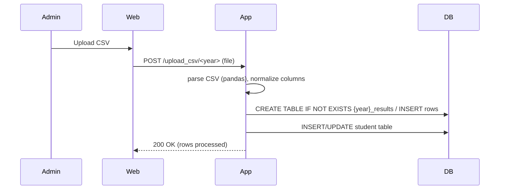

# Student Result Management System (SRMS)

## Getting Started

### Clone the Repository

1. Open your terminal/command prompt
2. Navigate to where you want to store the project
3. Clone the repository:
```bash
git clone https://github.com/yourusername/StudentResultSystem.git
```

### How to Run (Windows)

1. Navigate to project directory:
```powershell
cd "StudentResultSystem"
```

2. Create and activate virtual environment:
```powershell
python -m venv .venv
.\.venv\Scripts\Activate
```
(If using Command Prompt instead of PowerShell)
```cmd
.\.venv\Scripts\activate.bat
```

3. Install dependencies:
```powershell
pip install -r requirements.txt
```

4. Run the application:
```powershell
.\.venv\Scripts\python.exe app.py
```

Notes:
- Requires Python 3.8+
- Run commands in project root folder
- Default admin credentials: username=admin, password=admin123

## Background & Objective

This project is a simple Student Result Management System (SRMS) built with Flask and SQLite. It allows an administrator to upload CSV files containing students' marks for each academic year. The system creates year-specific result tables dynamically, stores student accounts, and provides student-facing result views with a calculated CGPA.

Objectives:
- Provide an easy way to upload and manage student marks per year via CSV files.
- Allow students to securely view their own results.
- Keep the system lightweight using SQLite and CSV input for flexibility.

## What this project does

This project provides a simple web application where administrators can upload student result CSV files for different academic years. The app creates or updates a results table for the selected year, stores student records, and allows students to log in and view their own results and an automatically computed CGPA.

## How it works (high-level)

1. Admin logs in to the web UI and uploads a CSV file for a chosen year.
2. The application (Flask) uses pandas to parse the CSV, normalize column names, and infer column types.
3. A dynamic table named `<year>_results` is created in SQLite (if it doesn't exist) and rows from the CSV are inserted.
4. The app creates/updates entries in the `student` table for each `roll_no` present in the CSV. Default password is set to the roll number (hashed).
5. Students can log in using their roll number and view their results. The app computes CGPA from numeric marks and displays it on the student dashboard.

## Why this is useful

- Quick onboarding of results via CSV: institutions often export marks to CSV from other systems — this app lets you import those files without building a new import script.
- Lightweight and easy to deploy: uses Flask and SQLite so it runs on low-resource servers or local machines for departmental use or demonstrations.
- Immediate student self-service: students can authenticate and view results without requiring manual delivery of marks.
- Flexible schema: the CSV-driven dynamic tables let admins upload different subject sets per year without changing code.

## Scope of the Project

In-scope:
- Uploading CSVs for multiple academic years and creating corresponding result tables.
- Admin management (login, view, edit, delete rows, clear year results).
- Student login and result viewing with CGPA calculation.

Out-of-scope (for this simple implementation):
- Role-based permissions beyond Admin/Student.
- Audit logging, advanced analytics or reporting.
- Large-scale concurrency or multi-DB deployment.

## Proposed System

- Web frontend built with Flask templates located in `templates/`.
- Backend using SQLite database at `database.db`.
- CSV-driven approach: the admin uploads CSV files (must include `roll_no` and `name`) and the system creates/updates a `{year}_results` table.

## Problem Definition

Educational institutes need a lightweight way to manage and publish term/semester results. Manual spreadsheets are error-prone and time-consuming. This system automates ingestion of CSV results to a small web application where students can log in to view their results and admins can manage data.

## Proposed Solution

Use a Flask app with a simple SQLite database. CSV files are parsed using pandas and inserted into dynamically-created tables. Student accounts are auto-created/updated from the CSV (password defaults to the roll number hashed). The system includes basic admin and student authentication.

## Functional Requirements

1. Admin can log in and upload a CSV for a selected year.
2. CSV upload creates a `{year}_results` table if it does not exist, or inserts rows into it.
3. Each CSV must include `roll_no` and `name` columns.
4. Student accounts are created/updated from uploaded CSVs (default password = roll number).
5. Students can log in and view their results and CGPA.
6. Admin can view, edit, delete individual result rows and clear a year's results.

## Software Requirements

- Python 3.8+ recommended
- Libraries (see `requirements.txt`):
  - Flask
  - pandas

Example (Windows PowerShell) to prepare the environment:

```powershell
python -m venv venv
.\n+venv\Scripts\Activate.ps1
pip install -r requirements.txt
```

Set an optional secret key for production:

```powershell
$env:SRMS_SECRET_KEY = 'replace_this_with_a_secure_secret'
```

Run the app:

```powershell
python app.py
```

The app uses `database.db` in the project root and stores uploaded CSVs under `uploads/`.

## ER Diagram

This implementation uses a very small schema. Add a PNG/SVG to `static/images/` and reference it here if you want a visual.

Placeholder (textual):

- Admin (username PK)
- Student (roll_no PK) -> attributes: name, password_hash, year
- Year Results (dynamic tables named `first_year_results`, `second_year_results`, ...), each row stores marks and includes auto-increment `id` plus columns discovered from CSV (including `roll_no`, `name`).

To add an image: create `static/images/er_diagram.png` and embed it in this README or templates.

## Relational Schemas

Core fixed tables (SQLite dialect):

```sql
-- Admin table
CREATE TABLE IF NOT EXISTS admin (
  username TEXT PRIMARY KEY,
  password_hash TEXT NOT NULL
);

-- Student table
CREATE TABLE IF NOT EXISTS student (
  roll_no TEXT PRIMARY KEY,
  name TEXT NOT NULL,
  password_hash TEXT NOT NULL,
  year TEXT NOT NULL
);

-- Example year table (created dynamically based on CSV columns):
CREATE TABLE IF NOT EXISTS "first_year_results" (
  id INTEGER PRIMARY KEY AUTOINCREMENT,
  roll_no TEXT,
  name TEXT,
  DMS INTEGER,
  CN INTEGER,
  EFT INTEGER,
  DBMS INTEGER
);
```

Note: Column types for year tables are inferred from sample rows; non-numeric values are stored as TEXT.

## Normalization

This schema is largely in 3NF for the fixed tables:
- `student` stores one row per student (roll_no as PK).
- Year-specific result tables store multiple result rows per student per uploaded CSV. In a production design you'd normalize marks into a separate `marks` table and have a `subject` table; this implementation favors CSV-driven denormalized year-tables for simplicity.

## Data Dictionary (selected)

- admin.username: TEXT — admin login id
- admin.password_hash: TEXT — hashed password (werkzeug.security)
- student.roll_no: TEXT — student identifier (PK)
- student.name: TEXT — student name
- student.password_hash: TEXT — hashed password
- student.year: TEXT — student academic year (one of `first_year`, `second_year`, ...)
- {year}_results.id: INTEGER — auto PK
- {year}_results.roll_no: TEXT — student roll number (matches student.roll_no)
- {year}_results.name: TEXT — student name
- {year}_results.<subject>: INTEGER/TEXT — marks for a subject (CSV column names are normalized to underscore style)

## Sequence Diagram (high-level)

Mermaid syntax (viewable in many markdown renderers / editors):



## Data Flow Diagram (DFD) - Level 1 (textual)

1. Admin uploads CSV -> Server (Flask) -> Parser (pandas) -> Database (SQLite)
2. Student login -> Server -> DB lookup -> Serve result page

## Implementation & Testing

Backend (DBMS):
- SQLite (`database.db`) is used as the application database. The app code lives in `app.py`. The app initializes `admin` and `student` tables on first run.
- The app uses `pandas` to read CSV files and infers column types for dynamic tables.

Frontend:
- Server-rendered Flask templates in `templates/` and static css in `static/style.css`.

Testing performed (manual):
1. Start the app and confirm `database.db` is created and `admin` table contains the seeded admin user (`admin`).
2. Download a sample CSV via `/sample_csv/first_year` and upload it via the Admin UI.
3. Confirm `first_year_results` table exists and rows are visible in the admin UI.
4. Login as a student (roll number from CSV, password = same as roll number) and view results and computed CGPA.

### Automated / SQL-based checks (example queries)

```sql
-- List tables
SELECT name FROM sqlite_master WHERE type='table' ORDER BY name;

-- Check admin user
SELECT username FROM admin;

-- View sample rows
SELECT * FROM "first_year_results" LIMIT 10;

-- Get a student's results by roll
SELECT * FROM "first_year_results" WHERE roll_no = 'F1001';
```

## Sample Queries

- Create the admin/user/student tables (app already does this on start): see Relational Schemas.

- Insert sample student (if needed):

```sql
INSERT INTO student (roll_no, name, password_hash, year)
VALUES ('F1001', 'Alice Example', '<hashed-password>', 'first_year');
```

- Simple aggregate example: average marks for a subject

```sql
SELECT AVG(DMS) as avg_dms FROM "first_year_results";
```

## Test Cases

1. Admin login - valid credentials
   - Input: username=admin, password=admin123
   - Expected: Redirect to admin dashboard, flash message "Logged in as admin."

2. Admin upload CSV - valid CSV
   - Input: CSV with columns `roll_no,name,DMS,CN,EFT,DBMS`
   - Expected: `{year}_results` created/updated, students inserted/updated, success flash with row count.

3. Student login - valid
   - Input: roll_no from CSV, password = roll_no
   - Expected: Redirect to student dashboard showing result and CGPA.

4. Student login - invalid password
   - Input: roll_no valid, wrong password
   - Expected: Flash "Invalid roll or password." and no dashboard access.

5. Missing columns in CSV
   - Input: CSV missing `roll_no` or `name`
   - Expected: Upload aborted with danger flash "CSV must include a 'roll_no' column." or 'name'.

## Results of Testing

Manual tests carried out:
- App starts and initializes DB: PASS
- Admin seeded with default credentials: PASS
- Sample CSV download and upload: PASS (dynamic table created and rows inserted)
- Student login & result view: PASS (CGPA calculated when numeric marks present)

If you run into issues, check the Flask debug console and look for exceptions related to CSV parsing (pandas) or SQLite file permissions.

## Limitations & Future Scope

Limitations:
- Dynamic, denormalized year tables make cross-year queries harder.
- No role management beyond admin/student.
- Passwords are auto-generated from roll numbers by default (should force password change in production).
- No file size limits or rate-limiting for uploads.

Future improvements:
- Move to a normalized relational model: Students, Subjects, Exams, Marks, Years.
- Add file validation and preview before import.
- Add unit/integration tests and CI pipeline.
- Replace SQLite with PostgreSQL/MySQL for production use.
- Add secure password reset and email verification.

## Conclusion

This SRMS is a minimal, CSV-driven Flask application intended for small-scale result management and demo/teaching purposes. It demonstrates dynamic table creation, CSV ingestion with pandas, basic authentication, and a student-facing results view with CGPA computation. For production usage, consider the normalization and security improvements noted above.

---

If you'd like, I can:
- Add an ER diagram PNG/SVG and embed it in the README.
- Produce a small SQL script that migrates the dynamic tables into a normalized schema.
- Add unit tests for key functions like CSV parsing and CGPA calculation.
